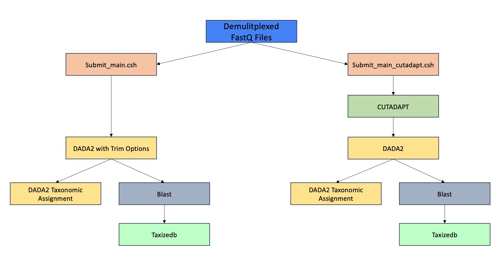

# DNAMetabarcoding

Pipeline for Amplicon Sequence Variant (ASV) resolution from microbial community fastq-formatted data. 

This Pipeline expects demulitplexed fastq data and outputs a comprhensive .csv file with taxonomic and abundance information for each ASV, as well as various Qiime objects needed for downstream processing in the Qiime platform.

This pipeline is based on the DNAmetabarcoding workflow developed by Jessica Parks and Jonathan Fleming and can be found here:
https://github.com/jessicaparks/DNAmetabarcoding.git

## Table of Contents

* [Installation](#installation)
* [Databases](#databases)
  * [DADA2 taxonomy databases](#dada2-taxonomy-databases)
  * [NCBI nt BLAST database](#ncbi-nt-blast-database)
  * [Taxize NCBI database](#taxize-ncbi-database)
* [DNAmetabarcoding Pipeline](#dnametabarcoding-pipeline)
  * [Pipeline Structure](#pipeline-structure)
  * [Primer trimming: cutadapt](#primer-trimming-cutadapt)
  * [Primer trimming: DADA2](#primer-trimming-cutadapt)
  * [ASV identification: DADA2](#asv-identification-dada2)
  * [Taxonomy: DADA2](#taxonomy-dada2)
  * [Taxonomy: BLAST and taxizedb](#taxonomy-blast-and-taxizedb)
 
## Installation
To install the pipeline on your local computer or server use the command listed here provided that git is installed. 
```bash
git clone https://github.com/jordenrabasco/DNAMetabarcoding.git
```
This will download the code to a directory named `DNAmetabarcoding`. After downloading the code run the following command from within the folder. This will make a conda environment with the appropriate packages. 
```bash
conda create -n dnametabarcoding -f environment.yml
```

## Databases
After all dependencies have been downloaded please make sure to download all necessary databases for your chosen taxonomic identification method. 
The BLAST taxonomic method utilizes both the NCBI nt BLAST database and the taxize and the Taxize NCBI database.

All methods utilize the taxize NCBI database, and the pipeline will then merge this information with either the taxonomic information from the NCBI nt BLAST database or those results from DADA2 taxonomy functionality. 

## DADA2 taxonomy databases
DADA2's maintainers and community have both contributed taxonomy databases that can be used to assign taxonomy with DADA2. The current list of taxonomy reference data available can be found in the [DADA2 documentation](https://benjjneb.github.io/dada2/training.html). Make sure that the database being utlize fits the community from which the data is sources (i.e. don't utilize a fungi database for a bacterial community).

### NCBI nt BLAST database
By default, this program uses the nt BLAST database. The nt database location can be changed in the `submit_main.csh` script. To update a local blast database run the example command below:
```bash
cd /usr/local/usrapps/trnL_blast/ncbi
conda activate /usr/local/usrapps/trnL_blast/jrabasc/meta_and_qiime
update_blastdb.pl --decompress nt
```
The newest versions of the NCBI BLAST databases can be viewed at https://ftp.ncbi.nlm.nih.gov/blast/db/.

### Taxize NCBI database
The taxize NCBI database from [taxizedb](https://ropensci.github.io/taxizedb/) is used to assign taxonomy to the taxids identified with BLAST. To download and then update this database run, `taxizedb_download.sh`. This script will download the most recent version of the database to the specified location.
```bash
cd DNAmetabarcoding
conda activate /usr/local/usrapps/trnL_blast/jrabasc/meta_and_qiime
Rscript taxizedb_download.R
```

## DNAmetabarcoding pipeline
The DNAmetabarcoding pipeline has three major steps those being primer identification and trimming with CUTADAPT, resolution of amplicon seqeunce variants with DADA2, and taxonomic identification with either DADA2 or BLAST. There is an option to skip the primer trimming step with CUTADAPT and instead remove the primers with the in-house DADA2 functions. 
WARNING: to use this method you will need to know the location of the primers within your reads. 

### Pipeline Structure
The main processing script for the pipeline is either `main.py` or `main_cutadapt.py`. Both scripts are dependent on functions from the scripts `dada2.R`, `dada2_taxonomy.R`, and `taxizedb.R`. The only difference between these two scripts is that one utilizes cutadapt for primer trimming and the other utilizes DADA2 processes. These main processing scripts will analyze a single fastq file. A job submission script `submit_main.csh`, allows to user to run `main.py` on all files within a directory, and submit those jobs to a cluster running a IBM Spectrum LSF system.




### Primer trimming: cutadapt
This pipeline starts with demultiplexed fastq sequence files, that are in fastq format and can be gzipped (`.fastq.gz`). [Cutadapt](https://cutadapt.readthedocs.io/en/stable/guide.html) is used to perform the primer trimming. The primer trimming step filters the input reads by the presence of a specific primer and removes the primer. This step has three different options `--trim_both`, `--prim_three_or_five_primer`, `--reverse_comp`. `--trim_both` takes a number of arguments each of which specify various `Cutadapt` options; these arguments are `both_rev` which trims both the forward and reverse primer sequences and will filter reads by the reverse primer sequence, `both_fwd` which will trim both the forward and reverse primer sequences and will filter reads by the forward primer sequence, `fwd` which will just filter reads based on and trim the forward primer, and `rev` which will just filter reads based on and trim the reverse primer. `--prim_three_or_five_primer` is used to determine the end of the read the primer is on that is being used to filter reads. There are three different options associated with this glad; `three` which implements the `-a` option on the filtering primer sequence and the `-g` option on the non-filtering primer sequence, `five` which implements the `-g` option on the filtering primer sequence and the `-a` option on the non-filtering primer sequence, and `none` which implements the `-b` option on both primer sequences, while still filtering based on the criteria input in the `--trim_both` argument. `--reverse_comp` option takes in `True` or `False` and if `True` will reverse complement the primer sequences prior to trimming. 
WARNING: The forward and reverse primers will always be in opposite orientations to each other when trimming 
Note: Primer matching for both of these cases is performed with a maximum error rate of 0.25 -- see cutadapt's [documentation on error tolerance](https://cutadapt.readthedocs.io/en/stable/guide.html#error-tolerance)

### Primer trimming: DADA2

This pipeline starts demulitplexed fastq sequence files, that are in fastq format and can be gzipped (`.fastq.gz`). [DADA2](https://benjjneb.github.io/dada2/index.html) is used to perform the primer trimming. The associated options with this functionality are `--cutoff` option which implements the DADA2 option `truncLen`. This step is run concurrent with the ASV idenitfication step described below.  

### ASV identification: DADA2
After primer trimming, reads are resolved to ASVs via the [DADA2](https://benjjneb.github.io/dada2/index.html) alogirthm. Before identifying the ASVs, an additional filtering step is applied with some standard filtering parameters recommended by DADA2's documentation. This removes any reads that contain N's (ambiguous bases), filters out reads that are above the maximum number of expected errors of 2 (parameter `maxEE`), truncates reads at the first position with a quality score less than 2 (parameter `truncQ`), and removes reads that match against the PhiX genome (parameter `rm.phix`), which is commonly used as a control in Illumina sequencing runs. These filters parameters can be adjusted in the file `dada2.R` and more detail on them can be found [here](https://rdrr.io/bioc/dada2/man/filterAndTrim.html) and elsewhere in DADA2's documentation.

After this read filtering, DADA2 learns the error rates from the sequencing data, dereplicates any identical sequencing reads, and then applies the DADA2 algorithm to infer the ASVs. More information about the algorithm can be found in the paper [DADA2: High-resolution sample inference from Illumina amplicon data](https://www.nature.com/articles/nmeth.3869). Lastly, chimeric sequences are removed from the ASVs. More detail about each of these operations can be found in this [DADA2 tutorial](https://benjjneb.github.io/dada2/tutorial.html). The final result from processing the trimmed reads with DADA2 is a table of ASV sequences and their abundance in the sample.

### Taxonomy: DADA2
One of the options for taxonomic classification provided with this program is the use of DADA2's assignTaxonomy function. An example of how this is used can be found in the Assign Taxonomy section of the [DADA2 tutorial](https://benjjneb.github.io/dada2/tutorial.html). This uses taxonomy reference data sets, provided by DADA2, which are detailed in the [DADA2 taxonomy databases](#dada2-taxonomy-databases) section below. Currently, the GTDB and UNITE data sets are downloaded to the cluster. The different reference data sets may be more appropriate to use with certain samples, depending on whether the sample composition is microbial, fungal, or other eukarotic. To use the DADA2 taxonomy assignment, set the argument for `--taxmethod` to `DADA2` and the argument for `--taxreference` to the appropriate reference data set.

### Taxonomy: BLAST and taxizedb
The other option provided for taxonomic classification is the use of a BLAST search versus the NCBI nt database, followed by the taxonomic assignment for the resulting taxids using [taxizedb](https://ropensci.github.io/taxizedb/).

The BLAST results are filtered by an evalue of 0.001, percent identity of 95, percent query coverage of 90, and maximum hits per sequence of 10. The results are further filtered to identify the top hit(s) for each query sequence by selecting only the hit(s) with the maximum percent identity.

The subject taxids from the filtered blast results are searched against the taxizedb NCBI database to identify the taxa corresponding to each taxid. If multiple taxids were present as the top hit for a sequence, a consensus taxonomy assignment is determined by assigning the taxa down only to the lowest rank that is consistent; lower ranks are not assigned.


